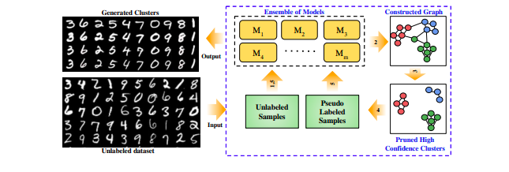
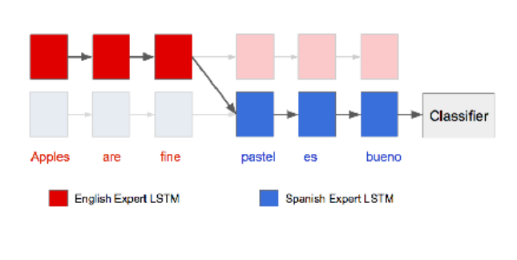
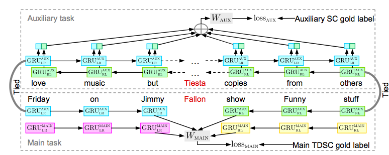
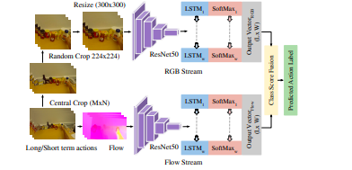
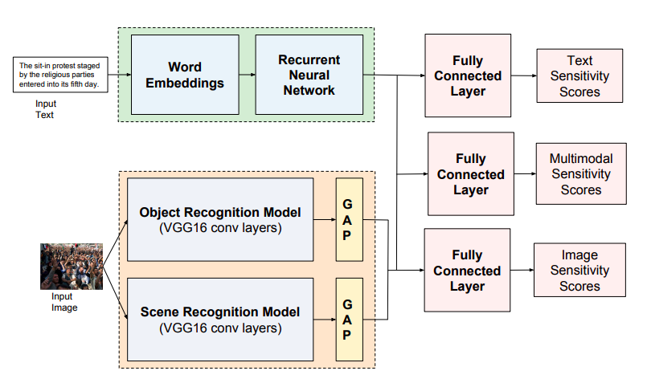

      

        
      

      

        <h5 class="item-title" style="font-weight: 700; margin-bottom: 0.5rem; ">
            Unsupervised Clustering using Pseudo-semi-supervised Learning
        </h5>
        <h6  style="font-weight: 500; margin-bottom: 0.5rem; ">
            <b>Divam Gupta</b>, Ramachandran Ramjee, Nipun Kwatra, Muthian Sivathanu
        </h6>
        <h6  style="font-weight: 500; margin-bottom: 0.5rem; " >
            ICLR 2020 <b>Accepted!</b>
        </h6>
        <h6 style="font-weight: 500; margin-bottom: 0.5rem; " >
            

            <a href="https://openreview.net/forum?id=rJlnxkSYPS">Paper</a> 
            

        </h6>
        
      

---

      

        
      

      

        <h5 class="item-title" style="font-weight: 700; margin-bottom: 0.5rem; ">
            GIRNet: Interleaved Multi-Task Recurrent State Sequence Models
        </h5>
        <h6  style="font-weight: 500; margin-bottom: 0.5rem; ">
            <b>Divam Gupta</b>, Tanmoy Chakraborty, Soumen Chakrabarti
        </h6>
        <h6  style="font-weight: 500; margin-bottom: 0.5rem; " >
            Thirty-Third AAAI Conference on Artificial Intelligence (<b>AAAI 2019</b>)
        </h6>
        <h6 style="font-weight: 500; margin-bottom: 0.5rem; " >
            

            <a href="https://arxiv.org/abs/1811.11456">Paper</a> / <a href="https://github.com/divamgupta/mtl_girnet">Code</a>
            

        </h6>
        
      

---

      

        
      

      

        <h5 class="item-title" style="font-weight: 700; margin-bottom: 0.5rem; ">
            Multi-task Learning for Target-dependent Sentiment Classification
        </h5>
        <h6  style="font-weight: 500; margin-bottom: 0.5rem; ">
            <b>Divam Gupta</b>, Kushagra Singh, Soumen Chakrabarti, Tanmoy Chakraborty 
        </h6>
        <h6  style="font-weight: 500; margin-bottom: 0.5rem; " >
            Pacific-Asia Conference on Knowledge Discovery and Data Mining (<b>PAKDD 2019</b>)
        </h6>
        <h6 style="font-weight: 500; margin-bottom: 0.5rem; " >
            

            <a href="#">Paper</a> / <a href="https://github.com/divamgupta/mttdsc">Code</a>
            

        </h6>
        
      

---

      

        
      

      

        <h5 class="item-title" style="font-weight: 700; margin-bottom: 0.5rem; ">
            Making Third Person Techniques Recognize First-person Actions in Egocentric Videos
        </h5>
        <h6  style="font-weight: 500; margin-bottom: 0.5rem; ">
            Sagar Kumar Verma, Pravin Nagar, <b>Divam Gupta</b>, Chetan Arora
        </h6>
        <h6  style="font-weight: 500; margin-bottom: 0.5rem; " >
            25th IEEE International Conference on Image Processing (<b>ICIP 2018</b>)
        </h6>
        <h6 style="font-weight: 500; margin-bottom: 0.5rem; " >
            

            <a href="https://ieeexplore.ieee.org/document/8451249">Paper</a> / <a href="https://github.com/sagarverma/ego_action_recognition">Code</a> / <a href="https://camo.githubusercontent.com/22bdc21edaf36d8d465f997d677ddca262156427/68747470733a2f2f73616761727665726d612e6769746875622e696f2f6f74686572732f494349505f65676f2e6a7067">Poster</a>
            

        </h6>
        
      

---

      

        
      

      

        <h5 class="item-title" style="font-weight: 700; margin-bottom: 0.5rem; ">
            Empowering First Responders through Automated Multi-modal Content Moderation
        </h5>
        <h6  style="font-weight: 500; margin-bottom: 0.5rem; ">
            <b>Divam Gupta</b>, Indira Sen, Niharika Sachdeva, Ponnurangam Kumaraguru, Arun Balaji Buduru
        </h6>
        <h6  style="font-weight: 500; margin-bottom: 0.5rem; " >
            International Conference on Cognitive Computing 2018 <b style="color: red;">Won the best paper award</b>
        </h6>
        <h6 style="font-weight: 500; margin-bottom: 0.5rem; " >
            

            <a href="https://ieeexplore.ieee.org/document/8457689">Paper</a> / <a href="https://github.com/precog-iiitd/multimodal-tweets-classification">Code</a> / <a href="https://www.slideshare.net/precogatIIITD/empowering-first-responders-through-automated-multimodal-content-moderation">Slides</a>
            

        </h6>
        
      

---

